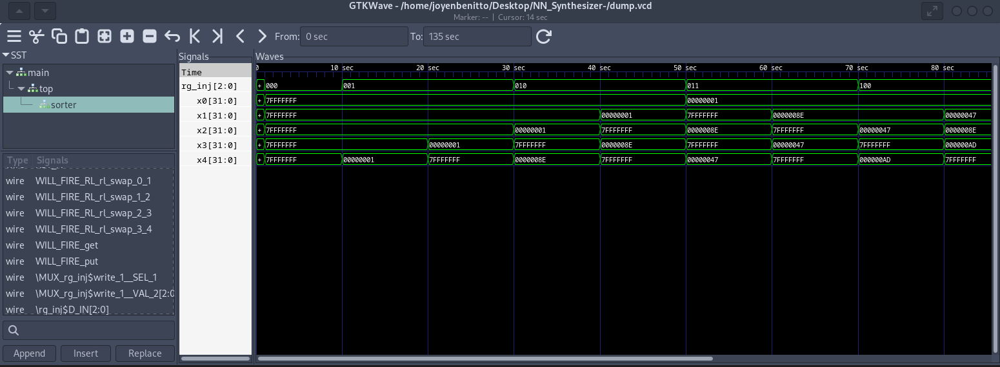
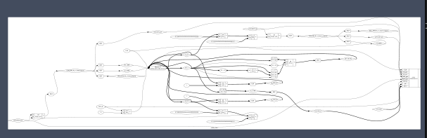
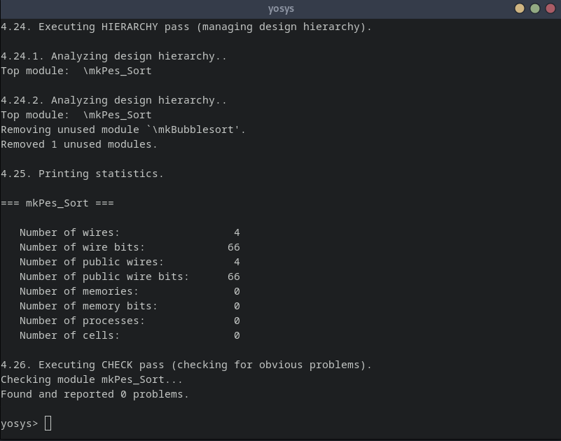

# pes_sort

This projest is a bubble sort accelerator which can be tightly coupled in the SoC for enhancing performance in big data and DBMS related workload.

# Synthesis on Yosys for Gate level simulation (GLS)
```bash
read_liberty -lib ../sky130_fd_sc_hd__tt_025C_1v80.lib
read_verilog mkPes_Sort.v
read_verilog mkBubblesort.v
synth -top mkPes_Sort
abc -liberty ../sky130_fd_sc_hd__tt_025C_1v80.lib
show
write_verilog -noattr sort.v
iverilog ../verilog_model/primitives.v ../verilog_model/sky130_fd_sc_hd.v sort.v syst mkTestbench.v
./a.out
gtkwave dump.vcd
```
## Waveforms


## RTL


## Stats
